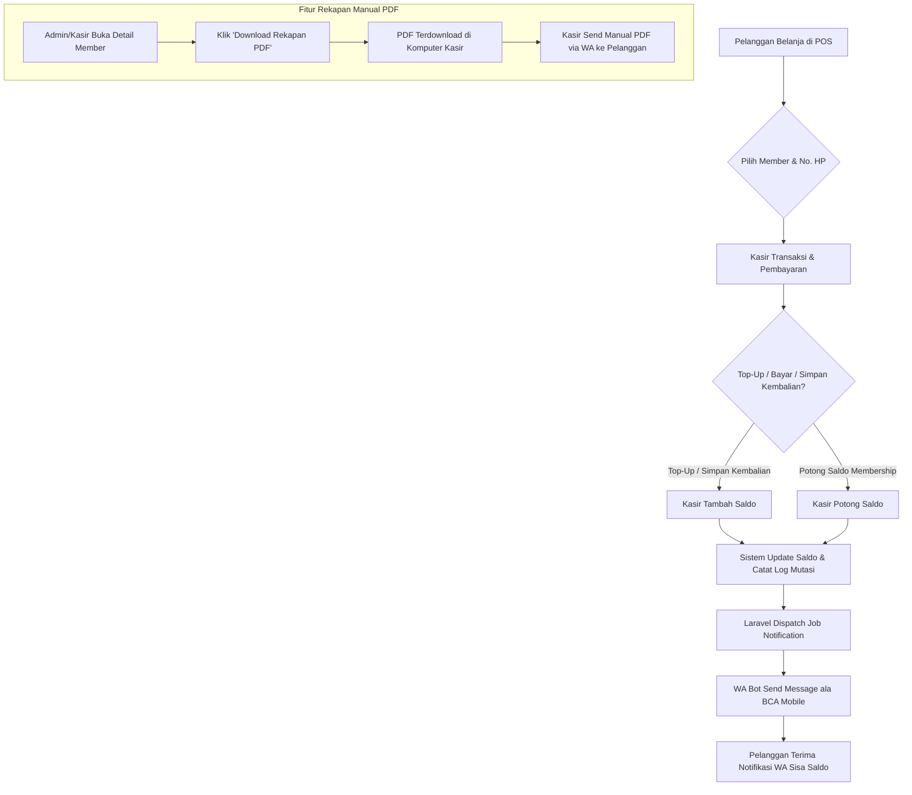

# 💡 Rencana & Konsep Fitur: Simalu Membership

## 📌 Ringkasan Konsep
Fitur **Simalu Membership** memungkinkan pelanggan Kopi Simalu untuk menyimpan saldo deposit dan memanfaatkannya sebagai metode pembayaran di kasir. Saldo dapat berasal dari:
1. **Kembalian Belanja** yang tidak diambil tunai, melainkan dimasukkan ke saldo membership.
2. **Top Up Tunai / QRIS / Transfer** yang disengaja oleh pelanggan untuk dipakai belanja.

Sistem dilengkapi dengan:
- **Notifikasi Otomatis WhatsApp Bot (Gaya BCA Mobile)**: Mengirimkan pesan notifikasi seketika (real-time) setiap kali ada penambahan saldo (Top-up/Kembalian) maupun pengurangan saldo (Pembelian), yang berisi nominal transaksi dan sisa saldo terkini.
- **Kartu Digital & Mutasi Halaman Web (`/membership/{token}`)**: Pelanggan bisa melihat riwayat saldo melalui link unik.
- **Export Rekapan Mutasi (PDF Manual)**: Admin/Kasir dapat mengunduh rekapan mutasi pengeluaran pelanggan format PDF untuk dikirim secara manual via WhatsApp.

---

## 🎯 Tujuan & Manfaat Bisnis
1. **Branding & Loyalty (Simalu Membership)**: Meningkatkan loyalitas pelanggan dengan sistem keanggotaan berbasis saldo.
2. **Solusi Uang Kembalian Pecahan Kecil**: Mengatasi masalah kelangkaan uang receh kembalian di kasir.
3. **Notifikasi Transparan ala Banking (BCA Mobile Style)**: Memberikan rasa aman & kepastian kepada pelanggan setiap kali saldo berkurang atau bertambah via WhatsApp Bot.
4. **Cash Flow & Customer Retention**: Advance payment meningkatkan likuiditas toko dan mengunci pelanggan untuk kembali lagi.

---

## 📲 Rekomendasi & Arsitektur WhatsApp Bot (Gratisan)

### Solusi WA Bot Gratis: **Node.js `@whiskeysockets/baileys`** atau **`whatsapp-web.js`**
- **Sifat**: 100% Gratis, Open Source, Tanpa Biaya Bulanan / Per Pesan.
- **Cara Kerja**:
  1. Microservice Node.js kecil berjalan di komputer kasir / server lokal (Port `3000`).
  2. Saat pertama kali dijalankan, scan QR Code WA dengan nomor HP khusus toko/membership.
  3. Laravel (POS) mengirim HTTP POST request ke `http://localhost:3000/send-message` setiap kali ada transaksi.
  4. Skrip Node.js langsung mengirim pesan ke nomor WA pelanggan secara instan.

### Contoh Format Pesan Notifikasi (Style BCA Mobile):

**1. Notifikasi Pengeluaran (Pembelian / Debet):**
```text
☕ [SIMALU MEMBERSHIP]
Transaksi Berhasil!

No. Transaksi : #ORD-20260812-001
Pengeluaran   : Rp 28.000
Sisa Saldo    : Rp 72.000
Waktu         : 12/08/2026 14:30 WIB

Terima kasih telah menikmati Kopi Simalu!
Cek detail mutasi: https://kopisimalu.id/membership/TOKEN
```

**2. Notifikasi Penambahan (Top-Up / Kembalian / Kredit):**
```text
☕ [SIMALU MEMBERSHIP]
Saldo Bertambah!

Tipe         : Top-Up Saldo (Cash)
Penambahan   : Rp 100.000
Total Saldo  : Rp 172.000
Waktu        : 12/08/2026 14:00 WIB

Terima kasih atas kepercayaan Anda!
```

### Mitigasi Risiko Akun WA Banned:
1. **Pengiriman Berbasis Event (Transactional Only)**: Bot HANYA mengirim pesan saat ada event transaksi asli di kasir (Bukan promosi massal/broadcast).
2. **Queue & Delay**: Menggunakan Laravel Queue (`shouldQueue`) untuk jeda acak 1-3 detik antar pengiriman jika ada antrean.
3. **Nomor Khusus Bot**: Gunakan nomor kartu perdana khusus untuk sistem Notifikasi Simalu (bukan nomor utama pemilik toko).

---

## 🔄 Alur Kerja (Workflow)



---

## 🛠️ Rancangan Teknis (Database & Integrasi)

### 1. Database Schema (Laravel)
- **Tabel `customers`**:
  - `id`
  - `name` (string)
  - `phone` (string, unique)
  - `balance` (decimal 12,2 - default 0)
  - `unique_token` (string/uuid - untuk URL akses publik)
  - `status` (active/inactive)
  - `timestamps`

- **Tabel `customer_mutations`**:
  - `id`
  - `customer_id` (foreign key to `customers`)
  - `order_id` (nullable, foreign key to `orders`)
  - `type` (enum: `topup`, `change_deposit`, `payment`, `refund`, `adjustment`)
  - `amount` (decimal 12,2)
  - `balance_before` (decimal 12,2)
  - `balance_after` (decimal 12,2)
  - `notes` (string)
  - `created_by` (foreign key to `users` - kasir)
  - `timestamps`

### 2. Fitur Kasir (POS)
- Search / Quick Register Member (Nama + No HP).
- Toggle/Checkbox: **"Simpan Kembalian ke Simalu Membership"**.
- Opsi Pembayaran: **"Simalu Membership"** (dengan konfirmasi sisa saldo).
- Otomatis memicu WA Bot Notifikasi transaksi secara background/queue.

### 3. Fitur Rekapan PDF (Manual Export)
- Tombol di Admin / POS: **[ 📄 Download Rekapan PDF ]**.
- Menggunakan library `barryvdh/laravel-dompdf` untuk membuat PDF laporan mutasi bulanan/custom periode.
- Kasir/Admin mengunduh PDF dan mengirimkannya secara manual ke WA pelanggan.

### 4. Halaman Web Member (`/membership/{token}`)
- Tampilan Kartu Member Digital Kopi Simalu (Responsive & Mobile-friendly).
- Informasi Total Saldo Terkini.
- Riwayat Mutasi (Kredit / Debet).
- QR Code Member untuk di-scan kasir saat bertransaksi.
